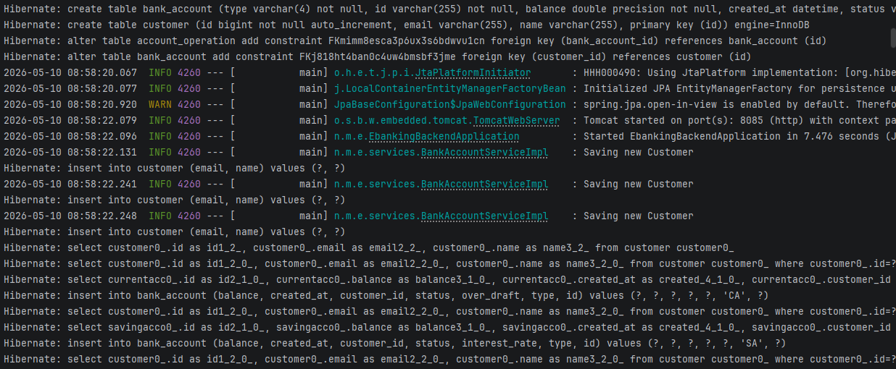

#  Digital Banking Project - Part 1: Backend

This repository contains the backend implementation of a **Digital Banking** system. It is designed using a clean, layered architecture with Spring Boot, ensuring a robust separation of concerns using Data Transfer Objects (DTOs), transaction-safe business logic, and custom exception handling.

---

##  Academic & Student Information
* **Student Name:** *[Majri Salma]*Master SDIA-1
* **Institution:** École Normale Supérieure de l'Enseignement Technique (ENSET) de Mohammedia
* **Under the supervision of:** Professor Mohamed YOUSSFI

---
##  Features implemented (Backend)

1. **JPA Domain Model**: Designed database schemas using JPA/Hibernate for:
    * `Customer` (Clients)
    * `BankAccount` (Abstract class with inheritance strategy)
        * `SavingAccount` (Savings account with interest rate)
        * `CurrentAccount` (Current account with overdraft limit)
    * `AccountOperation` (Debits, Credits, and Transfers)
    * `AccountStatus` (CREATED, ACTIVATED, SUSPENDED)
2. **Spring Data Repositories**: DAO layer implementations extending `JpaRepository` for seamless database interactions.
3. **Robust Service Layer**: Business logic handles accounts creation, credits, debits, and transfers with database transactions (`@Transactional`).
4. **Data Transfer Objects (DTOs)**: Implemented complete mapping between entities and DTOs using `BeanUtils.copyProperties` to avoid exposing the database structure directly to the REST API.
5. **REST API Controller**: Exposed secure endpoints inside `BankAccountRestAPI` and `CustomerRestController` supporting CRUD operations.
6. **API Documentation**: Integrated Swagger UI OpenAPI 3 to easily test REST API endpoints.

---

##  Project Structure

Here is the packages layout showcasing the clean layered architecture:

```text
src/main/java/net/majri/ebankingbackend/
│
├── dtos/                # Data Transfer Objects (DTOs)
├── entities/            # JPA Entities (Customer, BankAccount, AccountOperation...)
├── enums/               # Enumerations (AccountStatus, OperationType)
├── exceptions/          # Custom Business Exceptions (CustomerNotFoundException...)
├── mappers/             # Object Converters / Mappers (BankAccountMapper)
├── repositories/        # Spring Data Repositories / DAO Layer
├── services/            # Business Logic Layer (Interfaces & Implementations)
└── web/                 # REST Controllers (BankAccountRestAPI, CustomerRestController)
```
---
##  Tech Stack & Dependencies

* **Java 17+**
* **Spring Boot 3**
* **Spring Data JPA**
* **H2 Database** / **MySQL** (for persistent storage)
* **Lombok** (to reduce boilerplate code)


